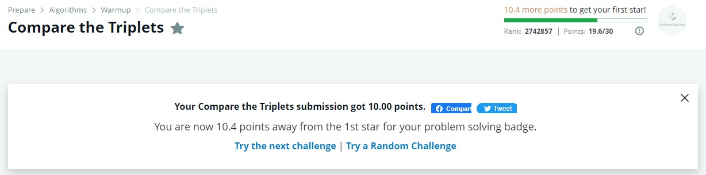
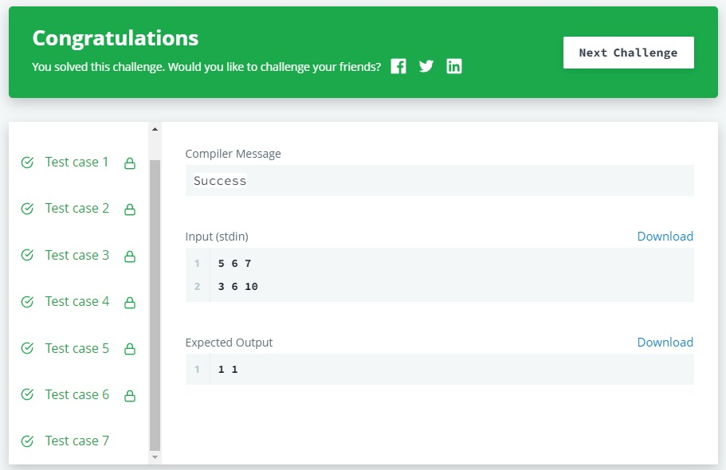

# Hackerrank's 'Compare the Triplets' Project

## Problem
Alice and Bob each created one problem for HackerRank. A reviewer rates the two challenges, awarding points on a scale from 1 to 100 for three categories: problem clarity, originality, and difficulty.

The rating for Alice's challenge is the triplet a = (a[0], a[1], a[2]), and the rating for Bob's challenge is the triplet b = (b[0], b[1], b[2]).

The task is to find their comparison points by comparing a[0] with b[0], a[1] with b[1], and a[2] with b[2].

If a[i] > b[i], then Alice is awarded 1 point.
If a[i] < b[i], then Bob is awarded 1 point.
If a[i] = b[i], then neither person receives a point.
Comparison points is the total points a person earned.

Given a and b, determine their respective comparison points.

## My solution
### JavaScript

```
function main() {
    var arrayAlice = readLine().split(' ');
    var arrayBob = readLine().split(' ');

    var alice0 = parseInt(arrayAlice[0]);
    var alice1 = parseInt(arrayAlice[1]);
    var alice2 = parseInt(arrayAlice[2]);
    var bob0 = parseInt(arrayBob[0]);
    var bob1 = parseInt(arrayBob[1]);
    var bob2 = parseInt(arrayBob[2]);
    
    var result = [0, 0];
    
    alice0 > bob0 ? result[0] += 1 : alice0 < bob0 ? result[1] += 1 : result[1] += 0;
    alice1 > bob1 ? result[0] += 1 : alice1 < bob1 ? result[1] += 1 : result[1] += 0;
    alice2 > bob2 ? result[0] += 1 : alice2 < bob2 ? result[1] += 1 : result[1] += 0;
            
    console.log(result[0] + " " + result[1]); 
}
```

## Errors and points after submitting the code

My final score was 10.0 points. All case tests were successfully compiled, that is, I solved this challenge in 100% of the cases.





